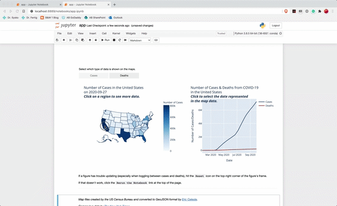
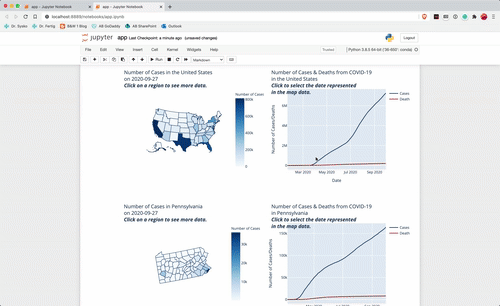
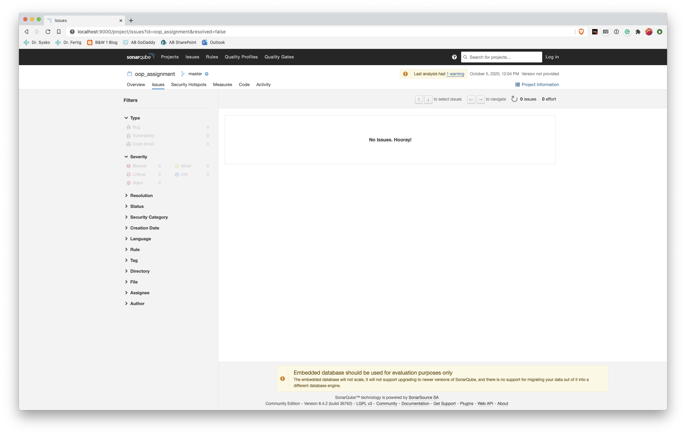

# Assignments Repository

Hello! This is my New York Times Coronavirus Dataset Explorer.

Apologies, but I did not follow the exact assignment requirements. The bulk of this program is not a console interface; instead, I built a fully interactive data exploration GUI. I wanted to get better at interactive data visualizations, so this built on using Jupyter Notebooks, Plotly, and IPyWidgets. These are the only three dependencies, beyond base Python 3+.

## Demo Screenshots

## SonarQube Screenshot

## 5 Instances of OOP Concepts

1. Abstract Classes: `Data` in `base_data_manager.py` is an abstract class that defines a unified data management object API and behavior. It forces its child classes to follow a lazy, callable, read-only, parameter-based singleton pattern, but most of the complex stuff is handled by the abstract `Data` base class.
2. Initializers / Constructors: `Data` has the most unique initializer in the project; it overrides the `__new__()` python function, which runs right before the standard `__init__()` function, to turn its instances to parameter-based singletons (i.e. for a given set of parameters, at most one instance exists).
3. Inheritance: The `Region` and `Date` data management nested classes located in covid_data_manager are the best examples of inheritance in the project: They inherit from the `Filter` class, which allows them to filter their outer class instance's data. `Filter` in turn inherits from the `CovidData` class, which provides a nice API for accessing frequently used data columns. `CovidData` finally inherits from `Data`, the aforementioned data management object abstract base class.
4. Composition: Any `Choropleth` plot-management instance is a composition of a GeoJSON_Manager geographic data manager object, a `CovidData` data manager object, a `plotly.graph_objects.FigureWidget`, and a `plotly.graph_objects.Choropleth`.
5. Class attributes & methods: The `Filter` abstract class has an abstract constant class attribute `FILTER_COL`, which is overwritten by child classes and then used to provide them with `Filter`'s built-in functionality.
